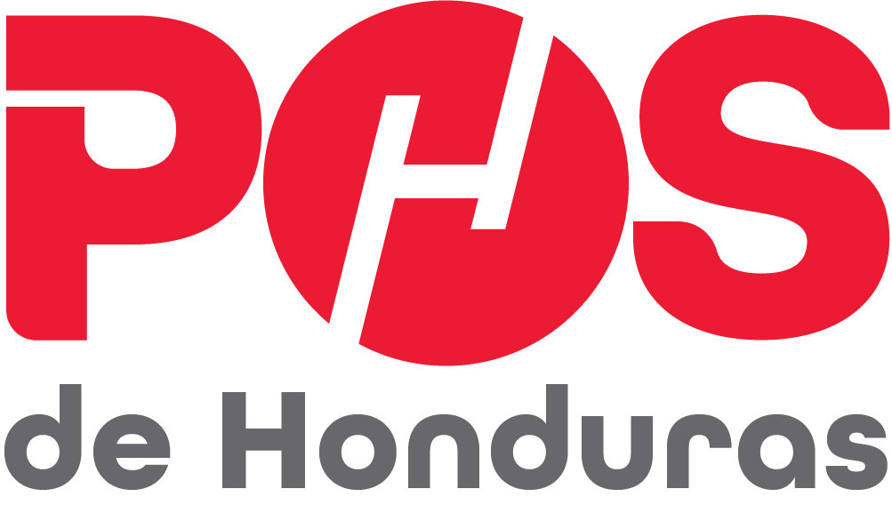

  
  <h1>POS de Honduras</h1>
  
Plataforma de registro de Bitácoras Técnicas para POS de Honduras

  

## 📋 Descripción

Sistema de Bitácora Técnica en Línea desarrollado para POS de Honduras, diseñado para digitalizar el registro, seguimiento y control de intervenciones técnicas realizadas a clientes. Construido con Next.js, TypeScript y Prisma, el sistema permite a técnicos y personal administrativo gestionar bitácoras, firmas digitales, encuestas de calidad y reportes detallados de forma centralizada, segura y accesible desde cualquier dispositivo.

## ✨ Características Principales

### 🔍 Para Técnicos y Clientes

- **Registro de Bitácoras**: Creación y edición de bitácoras con detalles como fecha, descripción del servicio, modalidad, horas consumidas y observaciones
- **Firma Digital del Cliente**: Envío automático de enlaces para firma remota mediante token seguro
- **Encuestas de Satisfacción**: Vinculadas a cada bitácora, permiten al cliente calificar el servicio recibido
- **Visualización de Saldo del Cliente**: Visualización del saldo de horas disponibles por cliente
- **Módulos disponibles para técnicos**: Perfil, Clientes, Bitácoras, Pagos, Equipos, Sistemas, Reportes
- **Interfaz Responsive**: Adaptada a tablets y smartphones para facilitar el trabajo en campo

### ⚙️ Para Administradores

- **Módulos disponibles**: El usuario administrativo tiene acceso total a todos los módulos y funciones del sistema
- **Panel de Administración**: Acceso seguro con autenticación, manejo de sesiones y control de usuarios activos/inactivos
- **Gestión de Usuarios**: Registro, edición, eliminación y firma digital de técnicos y otros administradores
- **Reportes Automatizados**: Previsualización y generación de reportes por cliente, por técnico (ventas y comisión) y reporte general
- **Encuesta Personalizada**: Creación, activación y monitoreo de encuestas de satisfacción
- **Configuración General**: Gestión de parámetros internos del sistema

## 🛠️ Tecnologías Utilizadas

### Frontend
- **Next.js 15**: Framework de React para SSR y API integrada
- **React 19**: Biblioteca para construir interfaces de usuario dinámicas y reactivas.
- **Tailwind CSS 4**: Estilizado con clases utilitarias
- **TypeScript 5**: Superset de JavaScript que añade tipado estático
- **React Hook Form**: Para manejo eficiente de formularios con validación
- **Zod**: Validación de formularios y datos del backend
- **Lucide-react**: Colección de iconos SVG personalizables integrada con React
- **SweetAlert2**: Biblioteca para crear modales y notificaciones visualmente atractivas
- **UUID**: Identificadores únicos para firmas y recursos
- **React Signature Canvas**: Captura de firma digital

### Backend
- **Prisma ORM 6.10**: ORM moderno y tipado para trabajar con bases de datos SQL
- **PostgreSQL 15**: Base de datos relacional
- **Next.js API Routes**: Rutas backend dentro de Next.js para manejar lógica del servidor
- **Nodemailer**: Envío de notificaciones por correo
- **jose / jsonwebtoken**: Manejo de JWT - Tokens
- **bcrypt / bcryptjs**: Hash y verificación de contraseñas
- **jsPDF + autotable**: Generación de PDF con tablas

---

## 👨‍💻 Desarrolladores

Este proyecto fue diseñado y desarrollado por:

- **Heiby Barahona**
- **Jorge Canales** 
